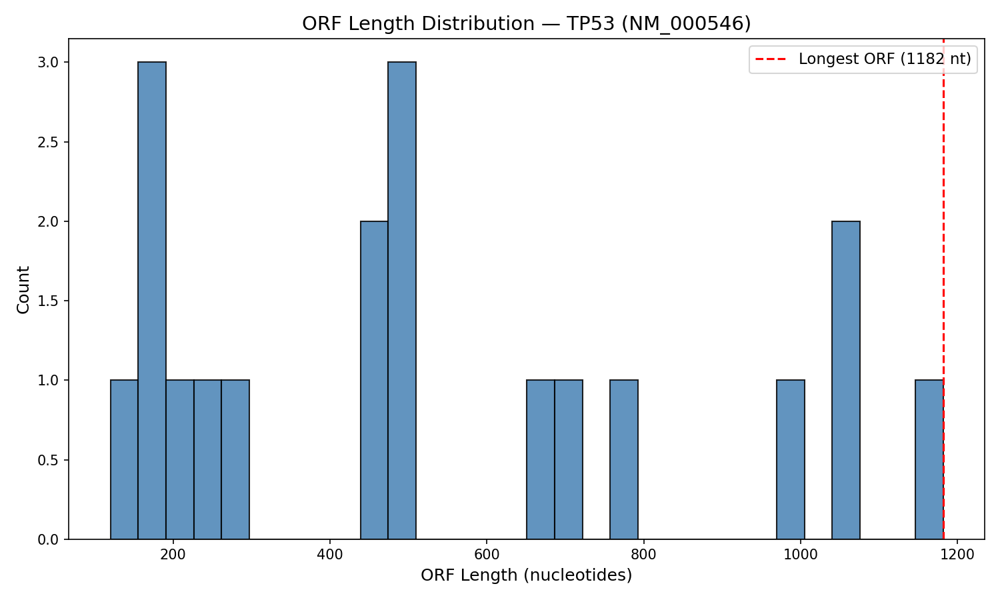

# DNA Sequence Analysis & NCBI Data Fetching

Fetch real gene sequences from NCBI and extract biological information using Python and Biopython.

## What This Project Does

- Fetches mRNA sequences from NCBI via the Entrez API
- Computes GC content
- Identifies Open Reading Frames (ORFs) on the forward strand
- Visualizes ORF length distributions

## Results — TP53 (NM_000546)

| Metric | Value |
|--------|-------|
| Transcript length | 2,512 nt |
| GC content | 53.38% |
| ORFs found (≥100 nt) | 466 |
| Longest ORF | 2,292 nt |

GC content (53.38%) is higher than the human genomic average (~41%), consistent with TP53 being a highly expressed tumor suppressor under strong selective pressure. The longest ORF (2,292 nt) likely represents the canonical coding sequence - shorter ORFs reflect nested reading frames from internal ATG codons.



## Limitations

- Forward strand only; full analysis would cover all 6 reading frames
- Many short ORFs are likely spurious

## Usage

```bash
pip install biopython matplotlib
python src/sequence_analysis.py
```

## Project Structure

```
bio-project-1-ncbi-analysis/
├── src/
│   └── sequence_analysis.py
├── results/
│   └── orf_distribution.png
└── README.md
```
